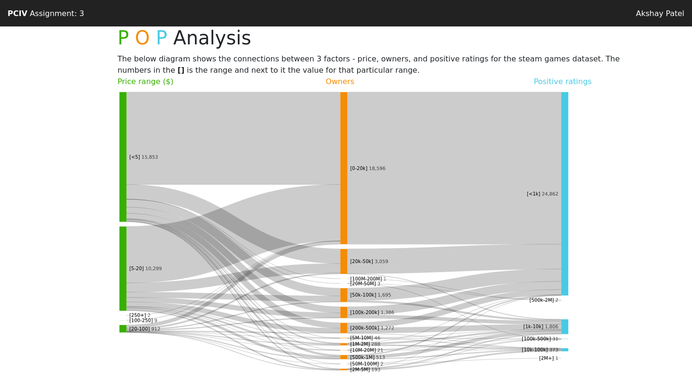

# Asssignment 3

This folder contains all files for assignment 3.

## Folders and Files

| folder/file | contents |
| ------ | -------- |
| public | folder that contains all the data files, HTML files and CSS files |
| src    | folder that contains your application files |
| package.json | JSON file that contains some project metadata, lists all dependencies and contains scripts/commands for the project |
| package-lock.json | automatically generated by npm when any operation modifies the node_modules tree or the package.json file |
| rollup.config.js | the rollup configuration file that determines how your files are bundled |

## The Server

### Setup

1. Make sure npm is installed ([https://www.npmjs.com](https://www.npmjs.com))
2. Run `npm install` in the console
    - This downloads and installs all dependencies listed in the **package.json**, creating the **node_modules** folder in the process.

### Start

1. Run `npm run dev` in the console
2. Open your browser and go to [http://localhost:5000](http://localhost:5000)

Alternatively, you can also use a **launch.json** (example provided) to launch the server via VS Code
or run the npm command via the `NPM SCRIPTS` tab in the VS Code explorer.

### Shut down

* The nice way: use the `Ctrl+C` hotkey and confirm
* The not so nice way: kill the terminal where the server is running

## Python Setup and Usage

To use the python scripts provided to you make sure you have Python >=3.7 installed.
If you have python installed, navigate to your data folder (`public/data`) on the command line and execute the following steps.

1. Create a virtual environment with `python -m venv <env-name>`
3. Activate your virtual environment with one of the following commands, depending on your OS and shell
    - Windows Shell: `<env-name>\Scripts\activate.bat`
    - Windows PowerShell: `<env-name>\Scripts\Activate.ps1`
    - POSIX bash/zsh: `source <env-name>/bin/activate`
    - POSIX fish: `source <env-name>/bin/activate.fish`
    - POSIX csh/tcsh: `source <env-name>/bin/activate.csh`
    - POSIX PowerShell Core: `<env-name>/bin/Activate.ps1`
2. Install all required packages
    - `pip install pandas~=1.1` (this will also install `numpy`, so no separate install necessary)
    - `pip install anytree~=2.8`
    - `pip install notebook~=6.0`
    - `pip install matplotlib` (optional, only necessary when you want to plot something)
3. To deactivate your virtual environment, type `deactivate`

### Jupyter Notebook

To open and edit a jupyter notebook, simply go to the data directory, activate your environment and type `jupyter notebook` to open jupyter notebook in the current directory or type `jupyter notebook <name>.ipynb` to directly open a specific notebook. This will start a local server and open your browser.
We provided a basic jupyter notebook file in the data directory to get you started.

For more information on jupyter notebook, please refer to [https://jupyter-notebook.readthedocs.io/en/stable/](https://jupyter-notebook.readthedocs.io/en/stable/).

### Graph Making Scripts

In the data directory, you will find two python scripts `make_hierarchy.py` and `make_graph_from_aggregate.py`. The scripts contain command-line utilities that take a data file and create a graph from it, stored in a JSON file. To execute a script, simply activate your environment and type `python <script_path> [args ...]`. Each script also has a help flag (`-h` or `--help`) which prints usage directions to the console.

**Make Hierarchy**

The `make_hierarchy.py` script expects the path to a data file (CSV) and a column to construct the hierarchy from. Optionally, you can also supply a maximum depth for the tree when the column is something other than time (add `[-d|--maxdepth] 4`) and a logging level to print more or less information to the console during execution (add `[-l|--loglevel] [ERROR|INFO|DEBUG]`).
Here is an example invocation:
```console
python make_hierarchy.py steam-store-games.csv time -l DEBUG
```

**Make Graph from Aggregate**

The `make_graph_from_aggregate.py` script expects the path to a data file (CSV) and a column to aggregate and use as nodes in the graph. Optionally, you can also supply a minimum threshold (add `[-t|--threshold] 10`) that must be given to include a node in the graph (e.g. at least 5 games must have a particular genre to include that genre in the graph) and a logging level to print more or less information to the console during execution (add `[-l|--loglevel] [ERROR|INFO|DEBUG]`).
Here is an example invocation:
```console
python make_graph_from_aggregate.py steam-store-games.csv genres -t 10
```

#### Result

