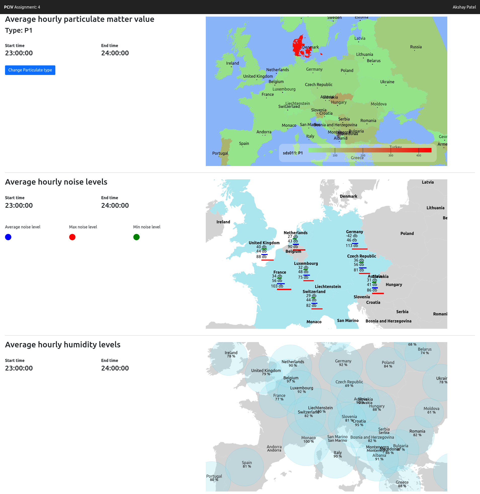

# Assignment 4

This folder contains all files for assignment 4.

## Folders and Files

| folder/file | contents |
| ------ | -------- |
| flask-server | folder that contains the database and the python file to setup the flask server |
| website/public | folder that contains all the data files, HTML files and CSS files |
| website/src    | folder that contains your application files |
| website/package.json | JSON file that contains some project metadata, lists all dependencies and contains scripts/commands for the project |
| website/package-lock.json | automatically generated by npm when any operation modifies the node_modules tree or the package.json file |
| website/rollup.config.js | the rollup configuration file that determines how your files are bundled |

## Flask Server

### Setup

To use the flask server provided to you make sure you have Python >=3.7 installed.
If you have python installed, navigate to your the folder `flask-server` on the command line and execute the following steps.

1. Create a virtual environment with `python -m venv <env-name>`
2. Activate your virtual environment with one of the following commands, depending on your OS and shell
    - Windows Shell: `<env-name>\Scripts\activate.bat`
    - Windows PowerShell: `<env-name>\Scripts\Activate.ps1`
    - POSIX bash/zsh: `source <env-name>/bin/activate`
    - POSIX fish: `source <env-name>/bin/activate.fish`
    - POSIX csh/tcsh: `source <env-name>/bin/activate.csh`
    - POSIX PowerShell Core: `<env-name>/bin/Activate.ps1`
3. Install all required packages
    - `pip install pandas~=1.1` (this will also install `numpy`, so no separate install necessary)
    - `pip install flask`
	
### Start
To run the Flask server run:
```bash
python server.py
```

### Shut down and deactivate virtual environment

* The nice way: use the `Ctrl+C` hotkey and confirm
* To deactivate your virtual environment, type `deactivate`

## Website

In Visual Studio code run the npm server.

### Setup

1. Make sure npm is installed ([https://www.npmjs.com](https://www.npmjs.com))
2. Run `npm install` in the console
    - This downloads and installs all dependencies listed in the **package.json**, creating the **node_modules** folder in the process.

### Start

1. Run `npm run dev` in the console
2. Open your browser and go to [http://localhost:5000](http://localhost:5000)

Alternatively, you can also use a **launch.json** (example provided) to launch the server via VS Code
or run the npm command via the `NPM SCRIPTS` tab in the VS Code explorer.

### Shut down

* The nice way: use the `Ctrl+C` hotkey and confirm

## Jupyter Notebook

To open and edit a jupyter notebook, simply go to the data directory, activate your environment and type `jupyter notebook` to open jupyter notebook in the current directory or type `jupyter notebook <name>.ipynb` to directly open a specific notebook. This will start a local server and open your browser.

For more information on jupyter notebook, please refer to [https://jupyter-notebook.readthedocs.io/en/stable/](https://jupyter-notebook.readthedocs.io/en/stable/).

## Loading database

1. Copy the `sensors.db` file to path `flask-server/sensors.db`
2. Run the juypter nodebook.
3. After all cells have been run successfully, a new file `flask-server/derived.db` will be created.

or 
1. Copy the file `derived.db` uploaded with the sumbmission to path `flask-server/derived.db`.

## Result

