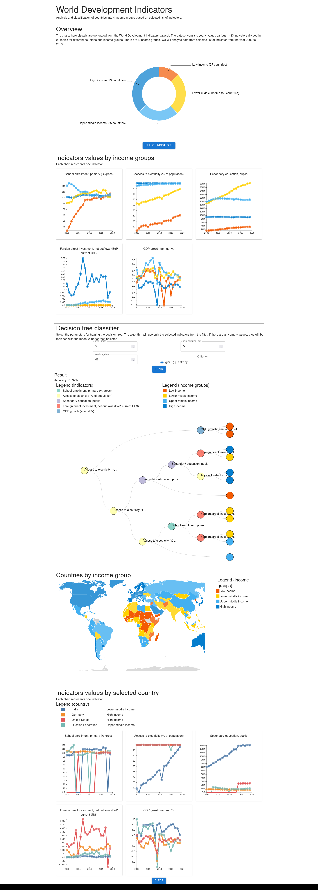

# World development indicators visualization.

## Front setup

Please refer: [frontend README.md](frontend/frontend-app/README.md)

## Backend setup

The jupyter notebook includes the code for downloading and creating the database.

Please refer: [backend README.md](backend/README.md)

## Result

