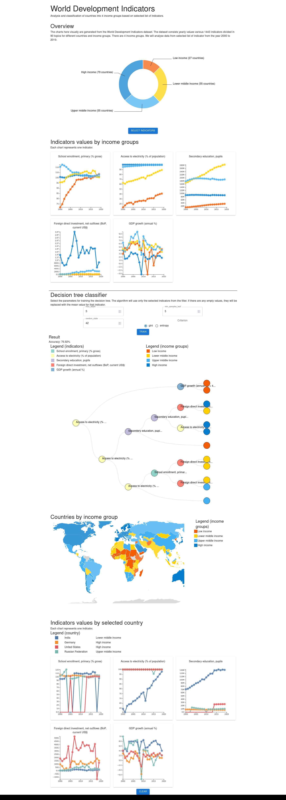

# World development indicators UI

This application is created using React.js, d3, mui.

It is expected that backend in running on port 5000 locally.

## Software used:

- Linux OS (Mint 20.2)
- Node v14.18.3

## Development setup

```bash
npm install
npm start
```

## Create build

```bash
npm run build
npx serve -s build -p 3000
```

### Result

